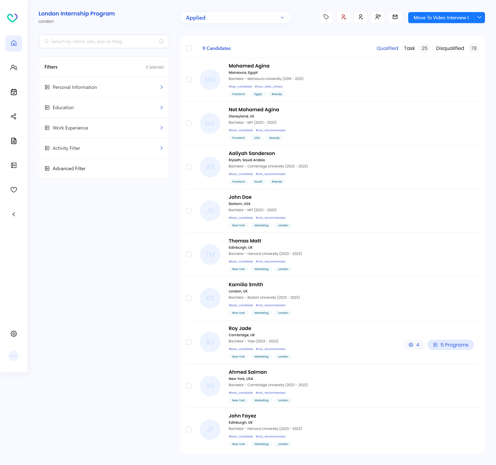
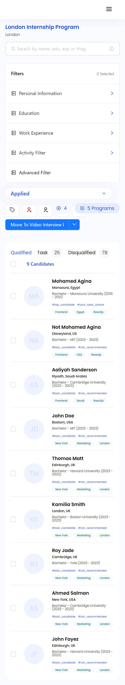

# Capital Placement - Dashboard

This is a solution to Capital placement technical assessment (task-2).

## Table of contents

- [Overview](#overview)
  - [The challenge](#the-challenge)
  - [Screenshot](#screenshot)
  - [Links](#links)
- [My process](#my-process)
  - [Built with](#built-with)
- [Author](#author)
- [Acknowledgments](#acknowledgments)

## Overview

### The challenge

Users should be able to:

- View the optimal layout for the site depending on their device's screen size
- List job candidates
- Filter candidates by search input
- Select candidates

### Screenshot

### Links

- Live Site URL: [Dashboard](https://ats-dashboard-mohamedagina.vercel.app/)

## My process

### Built with

- Semantic HTML5 markup
- CSS custom properties
- Flexbox
- Grid
- [React](https://reactjs.org/) - JS library
- [Ant design](https://ant.design/) - UI library

## Author

- Frontend Mentor - [@mohamedagina](https://www.frontendmentor.io/profile/mohamedagina)
- LinkedIn - [@mohamedagina](https://www.linkedin.com/in/mohamed-agina/)
